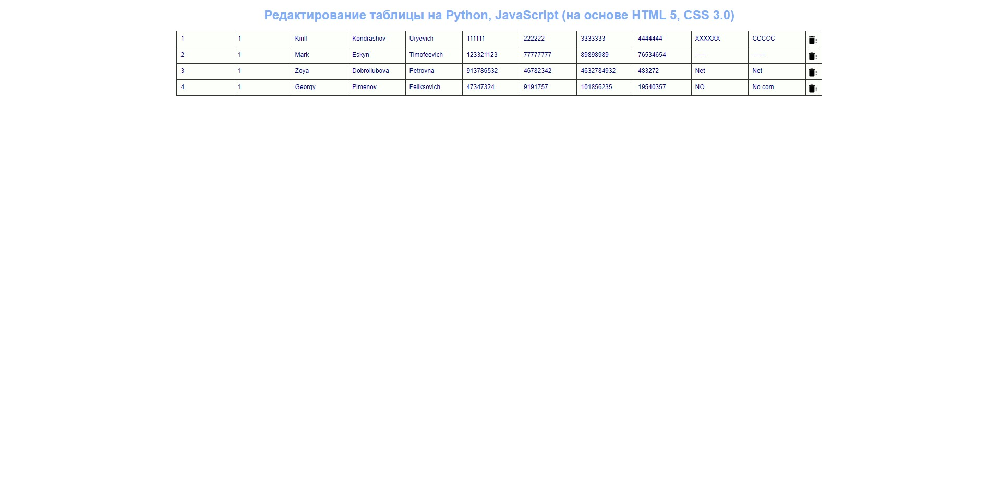

# Лабораторная работа №1

## Исправить код для Python для корректной работы базы данных в веб-приложении.

### В качестве базы данных используется MariaDB, запуск которой осуществляется с помощью docker-compose.
### Веб-приложение разворачивается с помощью python-фреймворка Flask. 

### Пример работы
  
1.

2.

3.

4.
