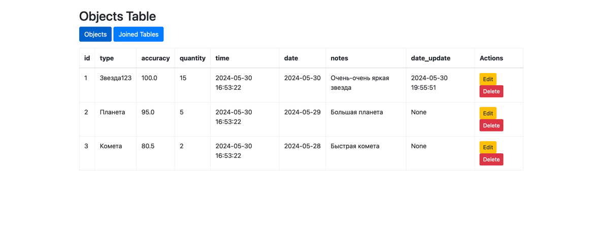

# Лабораторная работа №2

## Создать схему баз данных, разработать триггер, процедуру и исправить код для Python для корректной работы базы данных в веб-приложении.

### В качестве базы данных используется MariaDB, запуск которой осуществляется с помощью docker-compose.
### Веб-приложение разворачивается с помощью python-фреймворка Flask. По ходу выполненения работы было сильно изменено изначальный вариант приложения

### Пример работы
  
1. Проверка триггера

2. Таблицы полученные с помощью процедуры получения двух таблиц

